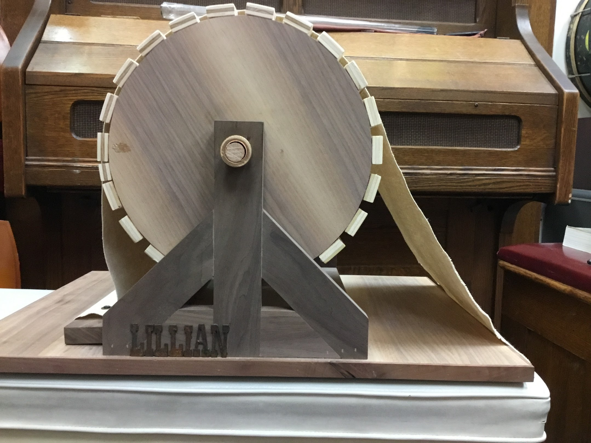
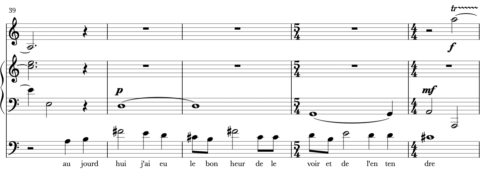
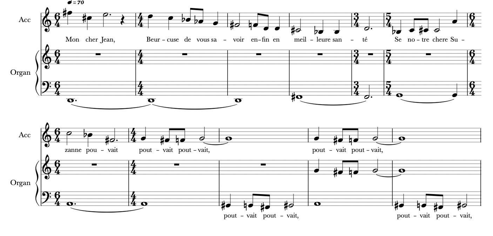

---
hide:
  - footer
---

# The Desks of Kador: Scoring an Epistolary Silent Film

*by Karen Majewicz*

The feature film of the program is _LE MYSTÈRE DES ROCHES DE KADOR_ (THE MYSTERY OF THE ROCKS OF KADOR), directed by Léonce Perret and released in 1912.

## Where is Kador?

<kbd>

A letter in the film asking a character to meet them at the "Roches (Rocks) de Kador".
</kbd>

There are many scenes that were filmed on a rocky beach in France. Being unfamiliar with French geography, I was not sure initially where this film is meant to take place. The "Rocks Of Kador" is not a placename in English, so determining the location took a bit of sleuthing.  

Click the arrows on the map to see the places depicted in the film. ([View the map in full screen here](https://umn.maps.arcgis.com/apps/instant/exhibit/index.html?appid=0160020ad120485da0c55e9e230cf565))

<iframe src="https://umn.maps.arcgis.com/apps/instant/exhibit/index.html?appid=0160020ad120485da0c55e9e230cf565" width="100%" height="500" frameborder="0" style="border:0" allowfullscreen>iFrames are not supported on this page.</iframe>

For the windswept beach scenes, the score calls for improvisation on open chords. The instrumentalists can play big sweeping held tones. You may even catch sight of a custom made wind machine, named Lillian after the famous Miss Gish.

<kbd>

The wind machine, "Lillian", used for outdoor scenes. Custom made by Isaac Schneider.
</kbd>

-------------

## Scoring an epistolary film

KADOR communicates much of its plot through letters, a device known in literature as “epistolary.”  While nearly all silent films rely on text in the form of title cards or written communication, the act of writing and reading letters is a central activity in _Kador_. However, they are also reacting - sighing with longing, huffing with anger, plotting evil plans, mulling over Susanne’s mysterious condition, scheming scenarios for justice, and confronting one another over forged missives.

<kbd>

</kbd>

How do you effectively score a scene where people are just reading or writing? The only visible movement on the screen is often a quick dip of a pen in an inkwell. One technique I have used it to create instrumental lines that are reminiscent of _recitativo_ , or spoke-sung lines in opera.  I often add lyrics to the score, even though no one will actually be singing them. It helps the players understand the gist of the scene and play expressively.

<kbd>

an excerpt from my _Kador_ score, with a cello recitativo line with lyrics
</kbd>

<kbd>

another excerpt with the accordion leading the narrative
</kbd>

-------------
## The Desks

Much of the action in this film takes place while our characters are sitting at desks. Indeed, they spend plenty of time reading and writing.Each notable character has their own writing desk, with a unique style.  Across its 40 minute runtime, there are six different writing desks placed in the center of the action.

### The lawyer’s desk
<kbd>
 
The first desk we see is that of a probate lawyer reading a will to our main characters (Susanne and Fernand). The decorated desk is formal, topped with some paperwork and a small bust. The desk is at the center of the frame angled slightly left.
</kbd>

### Susanne’s secretary desk
<kbd>

Next, we see our heroine Susanne’s small writing desk. This is a secretary design, where the writing ledge folds out. Susanne clearly enjoys writing and gazes thoughtfully into the distance and she considerers what to write. </kbd>

<kbd>

When she starts leaves the room, she makes a point to go back and lock it - telling us that there is something intimate and secretive about her writing. Susanne’s desk is at the edge of the screen facing left.
</kbd>

### Fernand’s desk
<kbd>

Fernand is our villian. He has a small, cramped desk that faces directly toward the camera. Here is where he carries out his forgeries and is shown burning a letter.
</kbd>

### Jean’s desk
<kbd>

Most of this desk is out of the picture, but it is clearly meant to be an impressive piece of furniture, set amidst an elegant room. Captain Jean is often on the telephone as well, perhaps signaling that he is a modern & progressive individual. Jean’s desk faces screen right.
</kbd>

###  The scientist’s desk 
<kbd>

The captain, with his can-do attitude, visits a doctor to consult on possible treatments for Susanne. The doctors desk looks sturdy and is topped with glass vials and science-y paraphernalia. The doctor’s desk faces away from the camera.
</kbd>

###  The police desk
<kbd>

This desk is in a similar position to the lawyer’s office - center screen, angled slightly left. This utilitarian piece of furniture is sparsely adorned in a plain room.
</kbd>

